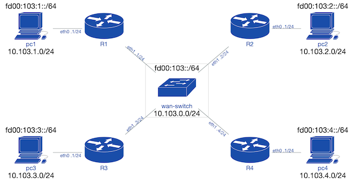

# Lab103 : OSPF quad pod

This lab is based on [github.com/goffinet/virt-scripts Lab103 : OSPF quad pod](https://github.com/goffinet/virt-scripts/tree/master/labs/103).

## Topology



<!--

IPv4 diagram :

```
   +---+ ***************   *************** +---+
   |PC1| *10.103.1.0/24*   *10.103.2.0/24* |PC2|
   +---+ ***************   *************** +---+
  +---+                                   +---+
    |                                       |
    |                                       |
    |   .1/24                        .2/24  |
 +--+-------+                       +-------+--+
 |   eth0   |                       |   eth0   |
 |    R1    |     ***************   |    R2    |
 |   eth1   |     *10.103.0.0/24*   |   eth1   |
 +----------+     ***************   +----------+
      |.1/24       +----------+     .2/24|
      +------------+          +----------+
                   |WAN SWITCH|
     +-------------+          +-----------+
     | .3/24       +----------+     .4/24 |
 +---+------+                       +-----+----+
 |   eth1   |                       |   eth1   |
 |    R3    |                       |    R4    |
 |   eth0   |                       |   eth0   |
 +-+--------+                       +--------+-+
   |                                         |
   |                                         |
 +-+-+  ***************    *************** +-+-+
 |PC3|  *10.103.3.0/24*    *10.103.4.0/24* |PC4|
 +---+  ***************    *************** +---+
+---+                                     +---+

```

IPv6 diagram :

```
    +---+ *****************                 +---+
    |PC1| *fd00:103:1::/64*                 |PC2|
    +---+ *****************                 +---+
   +---+                *****************  +---+
     |                  *fd00:103:2::/64*    |
     |                  *****************    |
     |   :1/64                        :1/64  |
  +--+-------+                       +-------+--+
  |   eth0   |                       |   eth0   |
  |    R1    |     ***************   |    R2    |
  |   eth1   |     *fd00:103::/64*   |   eth1   |
  +----------+     ***************   +----+-----+
       |:1/64       +----------+          | :2/64
       +------------+          +----------+
                    |WAN SWITCH|
      +-------------+          +-----------+
      | :3/64       +----------+     :4/64 |
  +---+------+                       +-----+----+
  |   eth1   |                       |   eth1   |
  |    R3    |                       |    R4    |
  |   eth0   |                       |   eth0   |
  +----------+                       +--------+-+
    |:1/64 *****************            :1/64 |
    |      *fd00:103:3::/64*                  |
  +-+-+    ************* ****               +-+-+
  |PC3|                 *****************   |PC4|
  +---+                 *fd00:103:4::/64*   +---+
 +---+                  *****************  +---+

```

-->

## First : Start the topology

```bash
docker run --rm --privileged --cap-add=ALL \
-v /lib/modules:/lib/modules -v /var/lib/libvirt:/var/lib/libvirt \
-v /var/log:/var/log -v /run:/run -v `pwd`:/opt/ -w /opt/ \
-it goffinet/terraform /bin/terraform init
docker run --rm --privileged --cap-add=ALL \
-v /lib/modules:/lib/modules -v /var/lib/libvirt:/var/lib/libvirt \
-v /var/log:/var/log -v /run:/run -v `pwd`:/opt/ -w /opt/ \
-it goffinet/terraform /bin/terraform  apply -auto-approve
```

## Virtual machines and networks

```bash
~/virt-scripts# virsh list --name
pc1-103
pc2-103
pc3-103
pc4-103
r1-103
r2-103
r3-103
r4-103
```


```bash
~/virt-scripts# virsh net-list
 Name                 State      Autostart     Persistent
----------------------------------------------------------
 default              active     yes           yes
 lan1-103             active     yes           yes
 lan2-103             active     yes           yes
 lan3-103             active     yes           yes
 lan4-103             active     yes           yes
 wan-103              active     yes           yes

```

## Interfaces verification (R1)

In the Linux shell :

```bash
[root@r1-103 ~]# ip link
1: lo: <LOOPBACK,UP,LOWER_UP> mtu 65536 qdisc noqueue state UNKNOWN mode DEFAULT qlen 1
    link/loopback 00:00:00:00:00:00 brd 00:00:00:00:00:00
2: eth0: <BROADCAST,MULTICAST,UP,LOWER_UP> mtu 1500 qdisc pfifo_fast state UP mode DEFAULT qlen 1000
    link/ether 52:54:00:c3:b1:cd brd ff:ff:ff:ff:ff:ff
3: eth1: <BROADCAST,MULTICAST,UP,LOWER_UP> mtu 1500 qdisc pfifo_fast state UP mode DEFAULT qlen 1000
    link/ether 02:8c:da:b4:5d:fa brd ff:ff:ff:ff:ff:ff
4: eth2: <BROADCAST,MULTICAST,UP,LOWER_UP> mtu 1500 qdisc pfifo_fast state UP mode DEFAULT qlen 1000
    link/ether 02:0a:a9:ea:9b:83 brd ff:ff:ff:ff:ff:ff
[root@r1-103 ~]# nmcli d
DEVICE  TYPE      STATE         CONNECTION
eth0    ethernet  connected     System eth0
eth1    ethernet  connected     Wired connection 1
eth2    ethernet  disconnected  --
lo      loopback  unmanaged     --
```

The eth2 is used to provide network in the firstboot post-installation that install Quagga ansd Dnsmasq. This 'disconnected' by NetworkManager.

In the Quagga shell :

```
[root@r1-103 ~]# vtysh

Hello, this is Quagga (version 0.99.22.4).
Copyright 1996-2005 Kunihiro Ishiguro, et al.

r1-103# show interface
Interface eth0 is up, line protocol detection is disabled
  index 2 metric 1 mtu 1500
  flags: <UP,BROADCAST,RUNNING,MULTICAST>
  HWaddr: 52:54:00:c3:b1:cd
  inet 10.103.1.1/24 broadcast 10.103.1.255
  inet6 fd00:103:1::1/64
  inet6 fe80::5054:ff:fec3:b1cd/64
Interface eth1 is up, line protocol detection is disabled
  index 3 metric 1 mtu 1500
  flags: <UP,BROADCAST,RUNNING,MULTICAST>
  HWaddr: 02:8c:da:b4:5d:fa
  inet 10.103.0.1/24 broadcast 10.103.0.255
  inet6 fd00:103::1/64
  inet6 fe80::9e43:5599:6015:6630/64
Interface eth2 is up, line protocol detection is disabled
  index 4 metric 1 mtu 1500
  flags: <UP,BROADCAST,RUNNING,MULTICAST>
  HWaddr: 02:0a:a9:ea:9b:83
Interface lo is up, line protocol detection is disabled
  index 1 metric 1 mtu 65536
  flags: <UP,LOOPBACK,RUNNING>
  inet 127.0.0.1/8
  inet6 ::1/128
```


## IPv4/IPv6 routing table on r2-103

```
[root@r2-103 ~]# vtysh

Hello, this is Quagga (version 0.99.22.4).
Copyright 1996-2005 Kunihiro Ishiguro, et al.

r2-103# sh ip route
Codes: K - kernel route, C - connected, S - static, R - RIP,
       O - OSPF, I - IS-IS, B - BGP, A - Babel,
       > - selected route, * - FIB route

K * 0.0.0.0/0 via 192.168.122.1, eth2 inactive
O   10.103.0.0/24 [110/10] is directly connected, eth1, 00:00:56
C>* 10.103.0.0/24 is directly connected, eth1
O>* 10.103.1.0/24 [110/20] via 10.103.0.1, eth1, 00:00:56
O   10.103.2.0/24 [110/10] is directly connected, eth0, 00:02:16
C>* 10.103.2.0/24 is directly connected, eth0
O>* 10.103.3.0/24 [110/20] via 10.103.0.3, eth1, 00:00:56
O>* 10.103.4.0/24 [110/20] via 10.103.0.4, eth1, 00:00:56
C>* 127.0.0.0/8 is directly connected, lo
r2-103# exit
```

```
r1-103# sh ipv6 route
Codes: K - kernel route, C - connected, S - static, R - RIPng,
       O - OSPFv6, I - IS-IS, B - BGP, A - Babel,
       > - selected route, * - FIB route

C>* ::1/128 is directly connected, lo
O   fd00:103::/64 [110/1] is directly connected, eth1, 00:00:22
C>* fd00:103::/64 is directly connected, eth1
O   fd00:103:1::/64 [110/1] via ::1, lo, 00:00:22
C>* fd00:103:1::/64 is directly connected, eth0
O>* fd00:103:2::/64 [110/2] via fe80::ff7a:8c8a:3b74:b757, eth1, 00:00:17
O>* fd00:103:3::/64 [110/2] via fe80::c0a8:ecbe:9958:7188, eth1, 00:00:17
O>* fd00:103:4::/64 [110/2] via fe80::f70e:98d1:9f7:d380, eth1, 00:00:21
C * fe80::/64 is directly connected, eth1
C>* fe80::/64 is directly connected, eth0
```

## End to end IPv4 connectivity from one of routers to each end PC

```bash
for id in 1 2 3 4 ; do
if [ ! -e /root/.ssh/id_rsa.pub ] ; then
ssh-keygen -q ; fi
ssh-copy-id 10.103.0.${id}
done
for id in 1 2 3 4 ; do
echo "R${id} --> PC${id}"
ping -c1 $(ssh 10.103.0.${id} "cat /var/lib/dnsmasq/dnsmasq.leases | grep pc | cut -d ' ' -f 3")
done
```

## End to end IPv4 connectivity from one PC to each LAN gateway interface

```bash
for id in 1 2 3 4 ; do
echo "PC${id} -->  LAN${id}"
ping -c1 10.103.${id}.1
done
```

## OSPF verifications

```
r1-103# show ip ospf neighbor

    Neighbor ID Pri State           Dead Time Address         Interface
   RXmtL RqstL DBsmL
2.2.2.2           1 2-Way/DROther     35.308s 10.103.0.2      eth1:10.103.0.1
       0     0     0
3.3.3.3           1 Full/Backup       39.025s 10.103.0.3      eth1:10.103.0.1
       0     0     0
4.4.4.4           1 Full/DR           35.199s 10.103.0.4      eth1:10.103.0.1
       0     0     0
```

```
r1-103# show ipv6 ospf6 neighbor
Neighbor ID     Pri    DeadTime  State/IfState         Duration I/F[State]
2.2.2.2           1    00:00:32 Twoway/DROther         00:06:08 eth1[DROther]
3.3.3.3           1    00:00:35   Full/BDR             00:05:07 eth1[DROther]
4.4.4.4           1    00:00:32   Full/DR              00:05:08 eth1[DROther]
```

```
r1-103# show ip ospf interface eth1
eth1 is up
  ifindex 3, MTU 1500 bytes, BW 0 Kbit <UP,BROADCAST,RUNNING,MULTICAST>
  Internet Address 10.103.0.1/24, Broadcast 10.103.0.255, Area 0.0.0.0
  MTU mismatch detection:enabled
  Router ID 1.1.1.1, Network Type BROADCAST, Cost: 10
  Transmit Delay is 1 sec, State DROther, Priority 1
  Designated Router (ID) 4.4.4.4, Interface Address 10.103.0.4
  Backup Designated Router (ID) 3.3.3.3, Interface Address 10.103.0.3
  Multicast group memberships: OSPFAllRouters
  Timer intervals configured, Hello 10s, Dead 40s, Wait 40s, Retransmit 5
    Hello due in 8.359s
  Neighbor Count is 3, Adjacent neighbor count is 2
```

```
r1-103# show ipv6 ospf6 interface eth1
eth1 is up, type BROADCAST
  Interface ID: 3
  Internet Address:
    inet : 10.103.0.1/24
    inet6: fd00:103::1/64
    inet6: fe80::9e43:5599:6015:6630/64
  Instance ID 0, Interface MTU 1500 (autodetect: 1500)
  MTU mismatch detection: enabled
  Area ID 0.0.0.0, Cost 1
  State DROther, Transmit Delay 1 sec, Priority 1
  Timer intervals configured:
   Hello 10, Dead 40, Retransmit 5
  DR: 4.4.4.4 BDR: 3.3.3.3
  Number of I/F scoped LSAs is 4
    0 Pending LSAs for LSUpdate in Time 00:00:00 [thread off]
    0 Pending LSAs for LSAck in Time 00:00:00 [thread off]
```

```
r1-103# show ip ospf database

       OSPF Router with ID (1.1.1.1)

                Router Link States (Area 0.0.0.0)

Link ID         ADV Router      Age  Seq#       CkSum  Link count
1.1.1.1         1.1.1.1          585 0x80000006 0x13b5 2
2.2.2.2         2.2.2.2          587 0x80000006 0xe9d4 2
3.3.3.3         3.3.3.3          586 0x80000008 0xbcf5 2
4.4.4.4         4.4.4.4          590 0x80000007 0x9514 2

                Net Link States (Area 0.0.0.0)

Link ID         ADV Router      Age  Seq#       CkSum
10.103.0.4      4.4.4.4          590 0x80000003 0x287a
```

```
r1-103# show ipv6 ospf6 linkstate

        SPF Result in Area 0.0.0.0

Type    Router-ID       Net-ID          Rtr-Bits Options        Cost
Router  1.1.1.1         0.0.0.0         -------- --|R|-|--|E|V6 0
Router  2.2.2.2         0.0.0.0         -------- --|R|-|--|E|V6 1
Router  3.3.3.3         0.0.0.0         -------- --|R|-|--|E|V6 1
Router  4.4.4.4         0.0.0.0         -------- --|R|-|--|E|V6 1
Network 4.4.4.4         0.0.0.3         -------- --|R|-|--|E|V6 1
```

```
r1-103# show ipv6 ospf6 linkstate
  <cr>
  detail
  network  Display Network Entry
  router   Display Router Entry
```

## Terraform references

- https://registry.terraform.io/providers/hashicorp/template/latest/docs/data-sources/file
- [template_file with count=N usage help #1893](https://github.com/hashicorp/terraform/issues/1893)
- https://stackoverflow.com/questions/51882802/terraform-using-count-index-in-a-resource-name
- https://www.terraform.io/docs/configuration/resources.html#count-multiple-resource-instances-by-count
- https://cloudinit.readthedocs.io/en/latest/topics/format.html
- https://github.com/hashicorp/learn-terraform-count-foreach/blob/master/main.tf
